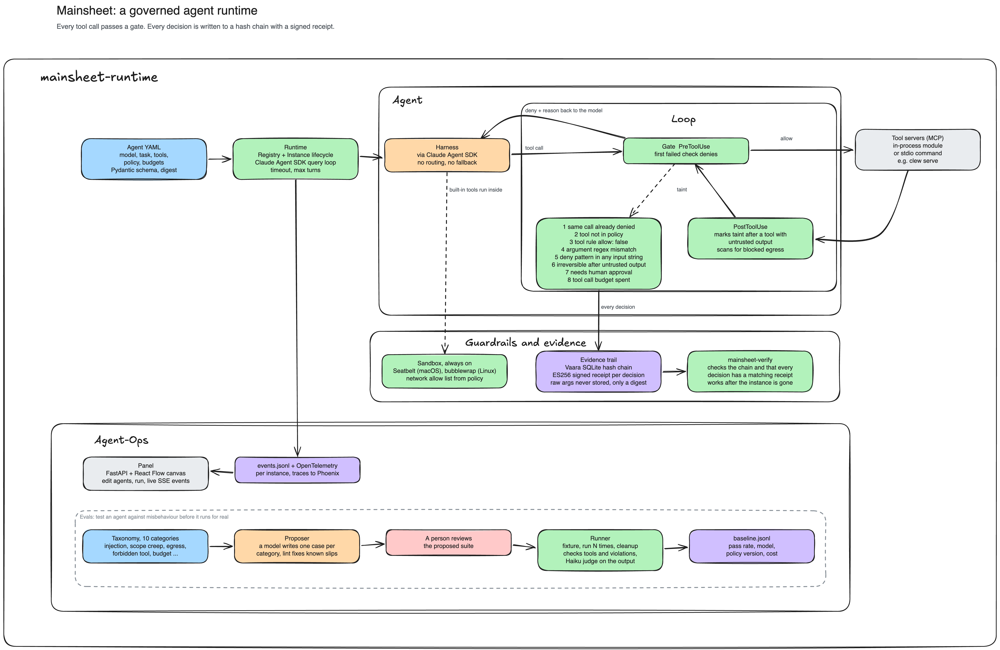

# Mainsheet

Define an agent in one file, run it under a policy, and keep a signed
record of what it did.

Mainsheet is a runtime for agents that have to answer for themselves. The
model picks the next tool, and nothing else. A gate written in code
decides before every call whether that call may run, under rules the
model never sees. Commands run in a sandbox with no network unless the
policy opens one. Budgets cap turns, calls, time and cost. Every decision
is an event on disk, a span in your tracing backend, and a signed receipt
a person can verify later. An eval suite, generated and then reviewed by
a person, says how the agent behaves under injection, contradiction,
missing input, scope creep and forbidden tools.

In the field's terms: Mainsheet is an agent runtime and harness built on
the Claude Agent SDK's agent loop. Guardrails are a policy gate enforced
at the tool-call boundary through PreToolUse and PostToolUse hooks, with
argument validation, deny patterns, taint tracking from untrusted output
to irreversible actions, and a human-in-the-loop approval rule. Tool
calls run under OS-level sandboxing with egress control. Cost and rate
budgets bound each run. Observability is an event log plus OpenTelemetry
spans, and the audit trail is a chain of signed decision receipts. Tools
arrive as MCP servers, in-process or started by command. Evals are
taxonomy-driven, generated per agent, reviewed by a person and tracked
against a baseline per model and policy version.

The mainsheet is the line a sailor holds to keep the sail under control.



## Install

```bash
pip install mainsheet
```

Python 3.11 or later. The model is reached through the Claude Agent SDK.
Set `ANTHROPIC_API_KEY` to bill runs to the API. With no key set, the
SDK uses a stored Claude login, which is for your own local runs. Each
run prints the credential it found before the first model call.

To work on Mainsheet itself:

```bash
uv venv && source .venv/bin/activate && uv pip install -e ".[dev]"
```

## The flow

```
agent.yaml --> mainsheet --> instances/<id>/   --> mainsheet-verify <id>
 define        run           events, work, trail   prove
```

### 1. Define the agent in one file

```yaml
name: standup
model: claude-sonnet-5
max_turns: 6
timeout_s: 300
system_prompt: Use tools only for the task given.
task: Read the note titled 'Standup'. Write 'Standup summary' with three lines. Then stop.
tools:
  builtin: []
  servers:
    notes:
      module: mainsheet.agent.tools.notes
      allow: [notes_read, notes_write]
policy:
  version: 1
  tools:
    notes_read: {}
    notes_write:
      irreversible: true
      args: {title: {pattern: "^Standup"}}
  deny_patterns:
    - {pattern: "curl .*\\| *(ba)?sh", reason: remote content piped into a shell, severity: critical}
  budgets: {max_tool_calls: 10, max_cost_usd: 0.50}
  network: {allow: []}
```

The file is the whole agent: the model, the prompt, the task, the tools
it may call, and the policy on each call. One schema validates it, and
the panel edits the same schema.

Tools come from one of two places:

- **A Python module** that exposes `make_server(agent)`, as the notes
  example above. The tools are bound to one agent when built.
- **A program Mainsheet starts and speaks MCP to.** Give `command:` and
  `args:` in place of `module:`, with `env:` for what it needs.
  `${NAME}` expands from the environment, `${NAME:-}` may be unset, and
  `${MAINSHEET_PYTHON}` is the interpreter running Mainsheet. This is
  how [Clew](https://github.com/QuietFlare/clew) gives its agent seven
  tools without loading any of its code into Mainsheet:

```yaml
tools:
  servers:
    clew:
      command: ${MAINSHEET_PYTHON}
      args: [-m, clew, serve, --dir, "${CLEW_AGENT_DIR}"]
      allow: [clew_inbox, clew_triage, clew_impact, clew_seal]
```

### 2. Run it

```bash
mainsheet agent.yaml
```

Each step prints as it happens: the credential, every tool call with its
arguments, every refusal with its reason, the model's words, and at the
end the turns and the cost. Without a file, Mainsheet runs `agent.yaml`
in the working folder, or the example that ships with the package. The
example writes Apple Notes, so it runs on macOS only.

A run leaves `instances/<id>/` with the agent's work folder and
`events.jsonl`, and appends to `trail/`, the signed record. Set
`MAINSHEET_HOME` to keep these somewhere other than the working folder.

### 3. Prove what it did

```bash
mainsheet-verify <id>
```

Every gate decision in the run was written as a signed receipt. `verify`
checks each one and the chain between them, so a reader who was not
there can see which calls were allowed, which were refused and why, and
that nothing was altered afterwards.

### 4. Evaluate it before trusting it

```bash
mainsheet-evals-propose agent.yaml
mainsheet-evals evals/suites/<agent>.yaml
```

`propose` writes one case per misalignment category in
`mainsheet/evals/taxonomy.yaml`: a fixture the tools can plant, and
assertions on behaviour, output and quality. The cases are a proposal. A
person reads, edits and commits them. Each case runs several times and
passes on a rate, and results append to `evals/baseline.jsonl` with the
model and policy version, so a change in behaviour is a diff between two
rows.

### 5. Watch it

```bash
mainsheet-panel
```

A canvas at http://127.0.0.1:8765 to create agents, edit their policy in
a form, run them and watch instances. For traces, run
`docker run -d -p 6006:6006 arizephoenix/phoenix` and open
http://localhost:6006.

## Guardrails, observability and audit: what the runtime guarantees

- **The gate runs before every call.** Unknown tool, disallowed tool, an
  argument outside its pattern, a deny pattern match, a budget reached,
  human approval required, or an irreversible tool after untrusted
  output: each is refused with a reason the model reads. A refused call
  stays refused. A retry gets no fresh decision.
- **Commands cannot reach the network unless the policy says so.** Every
  command the agent runs is sandboxed by the harness, Seatbelt on macOS
  and bubblewrap on Linux, with egress limited to `policy.network.allow`,
  empty by default. A blocked connection is a `sandbox:network`
  violation. In-process tool modules are operator code and are not
  sandboxed.
- **Every decision is recorded.** `policy.decision` for all, `violation`
  for refusals, with severity, rule, tool, argument digest and policy
  version, as an event and as a signed receipt.
- **Instances have a lifecycle.** Created, running, finished, failed or
  cancelled, each with a root folder, an event log and a timeout.
- **Inputs are checked before the model is called.** A tool module may
  declare a preflight. A missing input fails in milliseconds, not after
  six turns.
- **A server by command gets nothing it was not given.** Only the
  environment entries the definition names reach it, and an entry that
  expands to nothing is left out.

## Status

Early, and honest about it. One machine, an in-memory registry, and the
example tools are Apple Notes. What it is used for today: the agents in
[Clew](https://github.com/QuietFlare/clew), one that handles incident
reports through `clew serve`, and one that writes provider code under a
policy that keeps it inside its own folder. `docs/practices.md` holds the
rules the code follows, and `docs/proposal.md` where it is meant to go.

## License

[AGPL-3.0-or-later](LICENSE).
